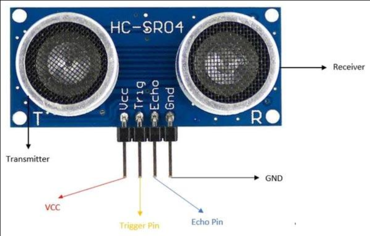
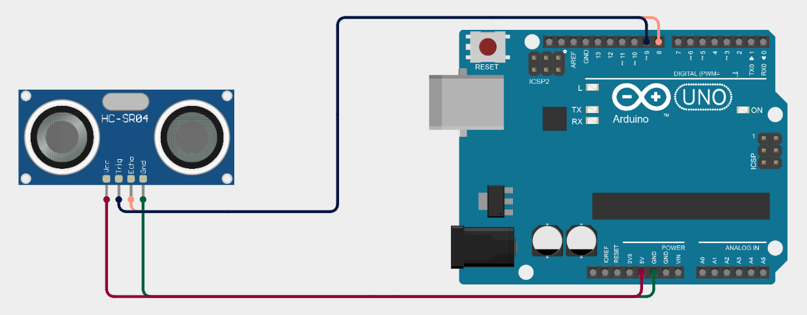

# HC-SR04 Ultrasonic Sensor
is a device that we use it to measure distance using ultrasonic wave 
## work principle 

In short, the Arduino sends an electrical pulse of 5 volts for at least 10 microseconds to the ultrasonic sensor. The sensor then responds by transmitting 8 ultrasonic pulses at a frequency of 40 kHz. This pattern of 8 pulses helps the sensor distinguish the transmitted signal from surrounding ultrasonic noise.

After transmitting the waves, the sensor sets the output signal to a high level and starts measuring the time. If the waves are reflected by an object and return to the sensor, the output signal changes to a low level when the reflected waves are received. The duration for which the output signal remains high represents the time taken by the wave to travel to the object and return to the sensor. This time is then used to calculate the distance to the object, so the time is divided by two because the wave travels the distance twice: once going to the object and once returning from it.

If the wave does not return, the output signal remains at a high level for up to approximately 38 milliseconds. After that, it changes to a low level. This indicates that the sensor did not receive a reflected wave within its measurement range.

formula : Distance  = (T x C)/2 
|formula|explain|
|-------|-------|
| T | time that wave took|
| C | speed of sound |


 diagram : 
Arduino
   ->
Trigger Signal
   ->
HC-SR04
   ->
Ultrasonic Waves
   ->
Object
   ->
Reflected Waves
   ->
Echo Signal
   ->
Time Measurement
   ->
Distance Calculation
## componet
|component| work |
|---------|------|
|vcc| This is the 5 Volt positive power supply |
|trig| This is the “Trigger” pin, the one driven to send the ultrasonic pulses|
|echo| This is the pin that produces a pulse when the reflected signal is received. The length of the pulse is proportional to the time it took for the transmitted signal to be detected|
|gnd| This is the Ground pin|
|transmitter| transmit the ultrasonic wave|
|receiver| receive the reflected wave |



## how to connect to Arduino
| part | were to connect |
|------|-----------------|
| vcc | connected to the 5v in the Arduino |
| trig | connected to any port like 9 or 11 in the Arduino |
| echo | connected to any port like 10 or 8 in the Arduino |
| gnd | connected to ground port in in the Arduino |



## coding 


```cpp
// Hook up HC-SR04 with Trig to Arduino Pin 10, Echo to Arduino pin 13

#define trigPin 10
#define echoPin 13

float duration, distance;

void setup() {
  Serial.begin (9600);
  pinMode(trigPin, OUTPUT);
  pinMode(echoPin, INPUT);
}

void loop() {
   
  // Write a pulse to the HC-SR04 Trigger Pin
  
  digitalWrite(trigPin, LOW);
  delayMicroseconds(2);
  digitalWrite(trigPin, HIGH);
  delayMicroseconds(10);
  digitalWrite(trigPin, LOW);
  
  // Measure the response from the HC-SR04 Echo Pin
 
  duration = pulseIn(echoPin, HIGH);
  
  // Determine distance from duration
  // Use 343 metres per second as speed of sound
  
  distance = (duration / 2) * 0.0343;
  
  // Send results to Serial Monitor

  Serial.print("Distance = ");
  if (distance >= 400 || distance <= 2) {
     Serial.println("Out of range");
  }
  else {
    Serial.print(distance);
    Serial.println(" cm");
    delay(500);
  }
  delay(500);
}
```
## result
Distance = 99.49 cm

Distance = 99.50 cm

Distance = 99.50 cm

Distance = 99.50 cm

Distance = 99.38 cm

all these read for the 100 cm object away from sensor

